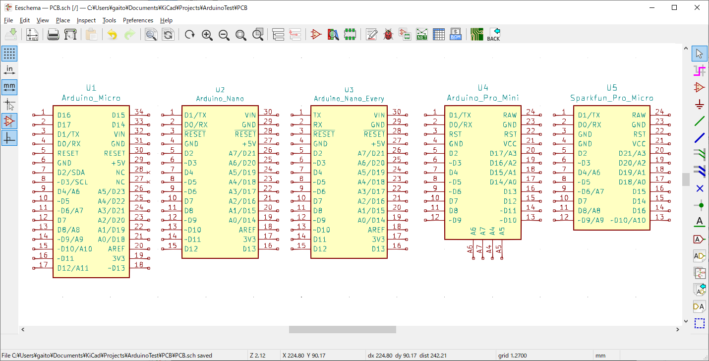
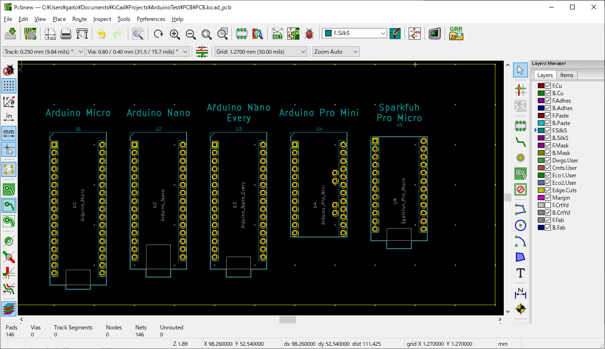
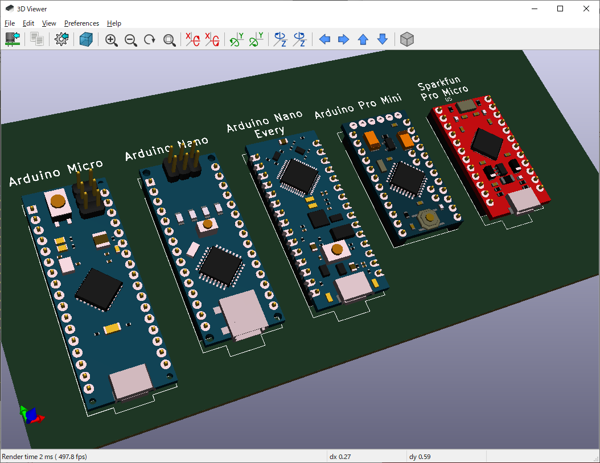

# kicad-lib-arduino

600mil width Arduino library for **KiCAD** with 3D models.
* Please set the path settings etc to suit your environment.
* 3D models are output as .x3d files from Blender, KiCAD's recommendation is .wrl but in my test, x3d can be used.

Include :  
> Arduino Micro  
> Arduino Nano  
> Arduino Nano Every  
> Arduino Pro Mini  
> Sparkfun Pro Micro  

## Files

| File                     | Description
|--------------------------|-------
| Arduino.dcm, Arduino.lib | Symbol library  
| Arduino.pretty           | Footprints  
| Arduino.3dshapes         | 3D models  

## Install

1. Copy files to your favorite folder of local PC.  
  `$ cd <YourPath>`  
  `$ git clone https://github.com/g200kg/kicad-lib-arduino.git`  
  or just  
  Download and place files (`Arduino.lib`, `Arduino.dcm`, `Arduino.pretty/*.*`, `Arduino.3dshapes/*.*`)  
  Here the your folder will be :  
```
< YourPath >
  |  
  +-- kicad-lib-arduino  
        +-- Arduino.lib  
        +-- Arduino.dcm  
        +-- Arduino.pretty  
        |     +-- *.kicad_mod  
        +-- Arduino.3dshapes  
              +--- *.x3d
```

2. Symbol  
 Open KiCAD's "Preferences"->"Manage Symbol Libraries"  
 Add line to "Global libraries"  
  Nickname=Arduino, LibraryPath=&lt;PathToYourFolder&gt;/kicad-lib-arduino/Arduino.lib, PluginType=Legacy  
  
3. Footprint  
Open KiCAD's "Preference"->"Manage Footprint Libraries"  
Add line to "Global Libraries"  
  Nickname=Arduino, LibraryPath=&lt;PathToYourFolder&gt;/kicad-lib-arduino/Arduino.pretty, PluginType=KiCad  
  
4. 3DModels  
Open KiCAD's "Preference"->"Configure Paths"  
Add line to "Environment Variables"  
  Name=LOCALREPO, Path=&lt;PathToYourFolder&gt;  
  * Because 3D Setting of footprints link to "${LOCALREPO}/kicad-lib-arduino/Arduino.3dshapes/xxxx.x3d"

### Symbol
  

### Footprint
  

### 3D Model
  

## License
Licensed under Creative Commons CC0

